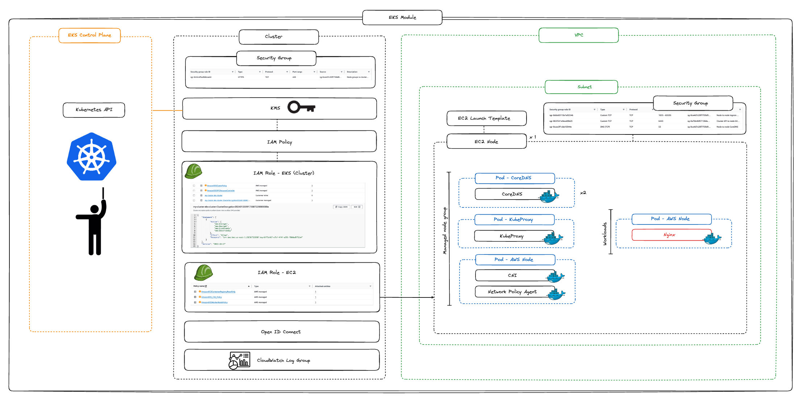
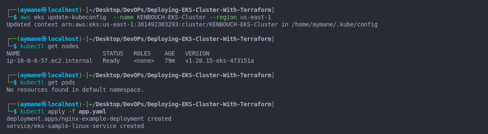
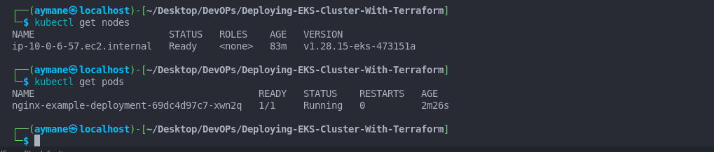
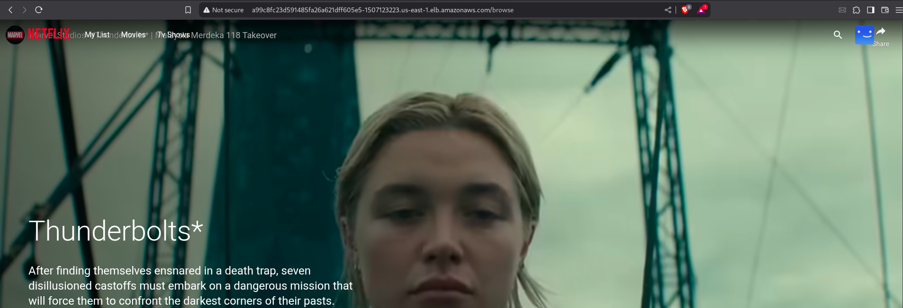

# Deploying Netflix Clone Application On EKS Cluster with Terraform.

## *Usage :*

This guide provides step-by-step instructions to deploy a production-ready Amazon EKS cluster using Terraform. for the purpose of learning Kubernetes !

I used  EKS Terraform Module : Documentation Link --> [https://registry.terraform.io/modules/terraform-aws-modules/eks/aws/latest]()



## *Prerequisites*

Before you begin, ensure you have:

- An AWS account with IAM administrator permissions
- A user with programmatic access (access key ID and secret access key)

## Installation

### 1. Install AWS CLI

```bash
curl "https://awscli.amazonaws.com/awscli-exe-linux-x86_64.zip" -o "awscliv2.zip"
unzip awscliv2.zip
sudo ./aws/install
rm -rf awscliv2.zip aws
```

### 2. Install Terraform

```bash
TF_VERSION=$(curl -sL https://releases.hashicorp.com/terraform/index.json | jq -r '.versions[].builds[].version' | egrep -v 'rc|beta|alpha' | tail -1)
curl -LO "https://releases.hashicorp.com/terraform/${TF_VERSION}/terraform_${TF_VERSION}_linux_amd64.zip"
unzip terraform_${TF_VERSION}_linux_amd64.zip
sudo mv -f terraform /usr/local/bin/
rm terraform_${TF_VERSION}_linux_amd64.zip
```

### 3. Install kubectl

```bash
curl -O https://s3.us-west-2.amazonaws.com/amazon-eks/1.28.3/2023-11-14/bin/linux/amd64/kubectl
chmod +x kubectl
sudo mv kubectl /usr/local/bin/
```

## Configuration

### Set up AWS credentials

```bash
aws configure
```

Enter your 

- AWS Access Key ID
- AWS Secret Access Key
- Default region name ( any region you want but prefer to use the one where you are deploying your cluster me in us-east-1)
- Default output format ( leave it for default )

## Deployment

1. Clone the repository:

```bash
git clone https://github.com/AymaneK24/Deploying-EKS-Cluster-With-Terraform.git
cd Deploying-EKS-Cluster-With-Terraform
```

2. Initialize Terraform:

```bash
terraform init
```

3. Review the execution plan:

```bash
terraform plan
```

4. Deploy the infrastructure (takes approximately 30 minutes):

```bash
terraform apply
```

## Cluster Access

After deployment completes:

1. Configure kubectl:

```bash
aws eks update-kubeconfig --region us-east-1 --name KENBOUCH-EKS-Cluster
```

2. Verify cluster access:

```bash

kubectl cluster-info
kubectl get nodes

```

## Cluster Information

- **Cluster Name**: KENBOUCH-EKS-Cluster
- **Kubernetes Version**: 1.28
- **Node Group**:
  - Instance type: t3.medium
  - Number of nodes: 1 (fixed size)

## Deploying My Application Netflix

I deployed on the cluster thr image of a netflix clone i already used in a previous project, you can use the image what ever you want, just make sure it's exposed on the port 80, if not change that in the dockerfile.

Go check the app.yaml file, and you will see the image i used it's aymanekh24/netflix , the name of the running container is netflix-container

then :

```
kubectl apply -f app.yaml
```

run this :

```
kubectl get svc
```

to see the running services, there you will also get the endpoint of the application Neflix (External-IP)








## Clean Up

To destroy all resources when no longer needed:

```bash
terraform destroy
```

## Notes

- The EKS cluster creation typically takes 20-30 minutes to complete
- The Terraform module creates multiple AWS resources including VPC, subnets, IAM roles, and security groups, etc
- For production environments, consider modifying the node group configuration for high availability

## Permission Configuration

You may encounter the following error when trying to access your cluster:

```
You must be logged in to the server (Unauthorized)
```

This occurs because AWS EKS requires explicit permission grants, even for IAM users with AdministratorAccess.

### Resolution Methods

#### Method 1: Console Configuration

1. Navigate to EKS Service → Your Cluster → Access
2. Add a new access entry for your IAM user
3. Assign these recommended policies:
   - `AmazonEKSAdminPolicy`
   - `AmazonEKSClusterAdminPolicy`

#### Method 2: Command Line Solution

1. First reset your kubeconfig:

   ```bash
   rm ~/.kube/config
   ```
2. Then update your configuration with proper permissions:

   ```bash
   aws eks update-kubeconfig --region us-east-1 --name KENBOUCH-EKS-Cluster
   ```
3. Run The script i provided you after modifying it :

   ```bash
   sh permission.sh
   ```

   then run again 1 and 2 to be sure then you are good !

#### Method 3: Using IAM Role (Alternative Approach)

1. AYou Will find the ARN in console in EKS Under Access Entries a default Role created
2. Note the role ARN
3. Configure kubectl with the role:
   ```bash
   aws eks update-kubeconfig --region us-east-1 --name KENBOUCH-EKS-Cluster \
   --role-arn arn:aws:iam::123456789012:role/EKSAdminRole
   ```

### Important Notes

What i learned : 

- AWS EKS has separate permission requirements from standard IAM policies
- AdministratorAccess IAM policy doesn't automatically grant EKS cluster access
- Always verify access entries in the EKS console after cluster creation

This permission setup only needs to be completed once per cluster. After proper configuration, you should have persistent access to manage your Kubernetes resources.
